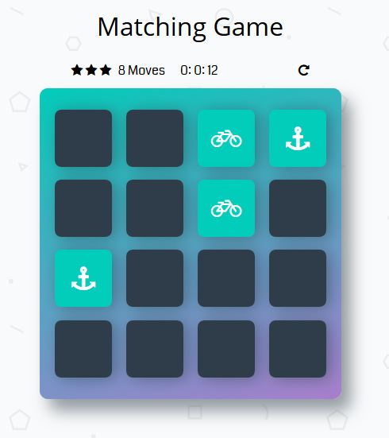
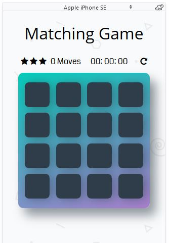
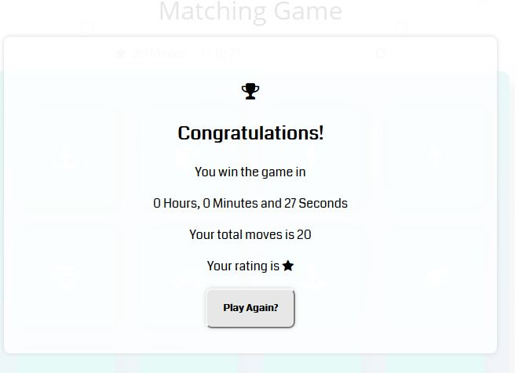

# Memory Game Project

- This game will test the strength of your memory
- Click [HERE](https://goo.gl/A5yJcg) to play the game

## Getting Started

- Open the game
- Click to open any card
- Click another card to find similar image on the first opened card 
- If  you find the match card, both cards will stay opened
- If you didn't find it, both cards will be closed again
- After you find all match cards, a Congratulation banner will inform you how long you spent on the game, how many steps did you perform and what is your rating
- Good Luck!
  
## Features of the Game

- Restart game button
- Live stopwatch
- Moves counter
- Star rating system
- Congratulation banner
- Responsive web page for different kind of devices

## Licence

This project is done as part of the Grow with Google Front-End Web Developer Nanodegree program by [Udacity](https://www.udacity.com).
